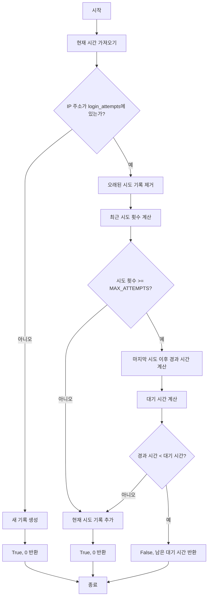

# 개요

- [소프트웨어 개발 생명주기와 주요 도구](../manual/소프트웨어%20개발%20생명주기와%20주요%20도구.md)

## 활용 도구

- 요구사항
	- [Github](../../utils/Github.md) 이슈
- 설계
	- [Obsidian](../../utils/Obsidian.md) : 문서 작성 도구
	- [Figma](../../utils/Figma.md) : 그림 작성 도구

## 실습

- (실습문제1) Brute-foce 공격 시도 화면
- (실습문제2) test 코드 실행된 화면

---


# 1. 보안 요구사항

- [Brute-force Attack](../manual/Brute-force%20Attack.md) 발생 위험 높음

## 보안 위험성(가설)
<iframe style="border: 1px solid rgba(0, 0, 0, 0.1);" width="800" height="450" src="https://embed.figma.com/board/3pR3DysZvHNqRyTTlz9q6K/FTP-Brute-force-Attack?node-id=0-1&embed-host=share" allowfullscreen></iframe>

## 위험성 검증

- 아래 명령어 활용하여 로그인이 가능하다. 
```
python main.py --host 192.168.100.20 --user cju --password security
```

		
- ID와 PW를 조합하여 명령어를 만들 경우, [Brute-force Attack](../manual/Brute-force%20Attack.md)이 가능하다.
```
python main.py --host 192.168.100.20 --user cju --password aaaaaaaa
python main.py --host 192.168.100.20 --user cju --password aaaaaaab
python main.py --host 192.168.100.20 --user cju --password aaaaaaac
python main.py --host 192.168.100.20 --user cju --password aaaaaaad
...
python main.py --host 192.168.100.20 --user cju --password security
```

## 공격 시도

### 공격 명령어 작성

```
python ftp_attack.py -H 192.168.100.20 -U short_users.txt -P short_passwords.txt
```

- 명령어 설명
	- `short_users.txt` : 사용자 아이디 집합
	- `short_passwords.txt` : 사용자 패스워드 집합

### 공격 알고리즘 개발

1. **시작 및 초기화**
	- 메인 함수 실행 및 배너 출력
	- 명령줄 인자 파싱 (`parse_arguments`)
2. **입력 처리**:
	- 사용자 이름 처리: 단일 사용자(`-u`), 사용자 리스트(`-U`), 또는 기본값(`cju`)
	- 비밀번호 처리: 단일 비밀번호(`-p`), 비밀번호 리스트(`-P`), 또는 기본값(`security`)
3. **브루트포스 공격 설정**:
	- `FTPBruteforcer` 객체 생성
	- 공격 초기화 및 정보 출력
	- 자격 증명 큐 생성
4. **멀티스레드 실행**:
	- 작업자 스레드 생성 및 시작
	- 각 스레드에서 자격 증명 시도
	- 로그인 시도 및 진행 상황 업데이트
5. **결과 처리**:
	- 성공 시: 성공 메시지 출력 및 결과 파일에 저장
	- 실패 시: 실패 메시지 출력

### 실행 결과


# 2. 설계

## 주요 취약점

- 무제한 로그인 시도
	- 로그인 실패에 대한 제한이나 지연 없음

## 보안 개선 방법

<iframe style="border: 1px solid rgba(0, 0, 0, 0.1);" width="800" height="450" src="https://embed.figma.com/board/3pR3DysZvHNqRyTTlz9q6K/FTP-Brute-force-Attack?node-id=11-51&embed-host=share" allowfullscreen></iframe>
- 로그인 시도 횟수와 시간 추적
- 일정 시간 내 최대 시도 횟수(3회) 제한
- 로그인 시도 기록 유지 시간 (300초/5분)

## 개선 사항

- 기존의 단순 `connect()` 대신 `secure_connect()` 함수를 사용하여 브루트 포스 공격에 대한 방어 기능 추가

- `secure_connect()` 내부 흐름
	- 브루트 포스 검사를 수행하여 로그인 시도가 과도한지 확인
	- 과도한 시도 감지 시 일시적으로 차단하고 대기 시간 표시
	- 연결 실패 시 지연 시간 적용으로 반복적 공격 속도 저하
	- 연결 성공 시 로그인 시도 기록 초기화

- 로그인 시도 제한 구현
	- - **최대 시도 횟수 제한**: 지정된 시간 내에 최대 로그인 시도 횟수 제한 (예: 5분 내 3회)

- 보안 상수 설정

| 상수           | 값   | 설명                    |
| ------------ | --- | --------------------- |
| MAX_ATTEMPTS | 3   | 지정된 시간 내 최대 로그인 시도 횟수 |
| LOCKOUT_TIME | 300 | 로그인 시도 기록 유지 시간(초)    |

## 개발 보안 로직

```
1. 현재 시간을 가져온다
2. IP 주소가 login_attempts에 있는지 확인한다
    - 없으면: 새 기록을 생성하고 로그인 허용(True, 0)
    - 있으면: 계속 진행
3. 오래된 시도 기록(LOCKOUT_TIME 이전)을 제거한다
4. 최근 시도 횟수를 계산합니다
5. 시도 횟수가 최대 허용 횟수(MAX_ATTEMPTS)를 초과했는지 확인한다
    - 초과하지 않았으면: 현재 시도를 기록하고 로그인 허용(True, 0)
    - 초과했으면: 계속 진행
6. 마지막 시도 이후 경과 시간을 계산한다
7. 대기 시간을 계산합니다: DELAY_FACTOR^(시도횟수-MAX_ATTEMPTS+1)
8. 경과 시간이 대기 시간보다 작은지 확인한다
    - 작으면: 로그인 거부(False, 남은 대기 시간)
    - 크면: 현재 시도를 기록하고 로그인 허용(True, 0)
```


# 3. 개발

## 개발 보안 코드

```python
def check_brute_force(ip_address: str) -> Tuple[bool, float]:
    """
    브루트 포스 방지 검사
    - True 반환: 로그인 시도 허용
    - False 반환: 로그인 시도 거부, 대기 시간(초) 제공
    """
    current_time = time.time()
    
    # IP 주소에 대한 로그인 시도 기록이 없으면 새로 생성
    if ip_address not in login_attempts:
        login_attempts[ip_address] = [current_time]
        return True, 0
    
    # 오래된 시도 기록 제거 (LOCKOUT_TIME 이전의 기록)
    login_attempts[ip_address] = [t for t in login_attempts[ip_address] 
                                if current_time - t < LOCKOUT_TIME]
    
    # 최근 시도 횟수 확인
    recent_attempts = len(login_attempts[ip_address])
    
    # 최대 시도 횟수 초과 확인
    if recent_attempts >= MAX_ATTEMPTS:
        # 마지막 시도 이후 경과 시간
        last_attempt_time = max(login_attempts[ip_address])
        elapsed = current_time - last_attempt_time
        
        # 대기 시간 계산 (시도 횟수에 따라 점진적으로 증가)
        wait_time = DELAY_FACTOR ** (recent_attempts - MAX_ATTEMPTS + 1)
        
        if elapsed < wait_time:
            return False, wait_time - elapsed
    
    # 현재 시도 기록
    login_attempts[ip_address].append(current_time)
    return True, 0
```





# 4. 테스트

## 테스트 목표

- 브루트 포스 공격 방지 메커니즘의
- 시간 기반 잠금 기능의 올바른 작동 확인
- 연속된 실패 시도에 대한 적절한 처리 확인
- IP 기반 추적 시스템의 정확성 확인

## 테스트케이스 구현

### 기본 기능 테스트

- **test_first_login_attempt**: 첫 번째 로그인 시도가 항상 허용되는지 확인
- **test_consecutive_login_failures**: MAX_ATTEMPTS까지의 시도는 허용되고, 초과 시 차단되는지 확인

### 시간 관련 테스트

- **test_login_failures_with_time_progression**: 시간 경과에 따른 차단 및 대기 시간 증가 확인
- **test_lockout_period_reset**: LOCKOUT_TIME 경과 후 시도 카운터가 리셋되는지 확인


## 테스트 케이스

```python
import unittest
import time
from unittest.mock import patch
import sys
import os

# secure_main 모듈을 직접 가져오기 위한 경로 설정
sys.path.append(os.path.dirname(os.path.abspath(os.path.dirname(__file__))))
import ftp.secure_main  # 전체 모듈을 임포트

class testSecureMain(unittest.TestCase):
    
    def setUp(self):
        """각 테스트 실행 전에 login_attempts 딕셔너리 초기화"""
        # 전역 모듈 변수 직접 초기화
        ftp.secure_main.login_attempts = {}
        self.test_ip = '192.168.100.20'  # 모든 테스트에서 고정 IP 사용
    
    def test_first_login_attempt(self):
        """첫 번째 로그인 시도는 항상 허용되어야 함"""
        allowed, wait_time = ftp.secure_main.check_brute_force(self.test_ip)
        
        self.assertTrue(allowed)
        self.assertEqual(wait_time, 0)
        self.assertIn(self.test_ip, ftp.secure_main.login_attempts)
        self.assertEqual(len(ftp.secure_main.login_attempts[self.test_ip]), 1)
    
    def test_consecutive_login_failures(self):
        """연속된 로그인 실패 테스트"""
        # 먼저 IP 주소가 login_attempts에 존재하는지 확인하고, 각 반복에서 검증
        for i in range(1, ftp.secure_main.MAX_ATTEMPTS + 1):
            allowed, wait_time = ftp.secure_main.check_brute_force(self.test_ip)
            self.assertTrue(allowed)
            self.assertEqual(wait_time, 0)
            self.assertIn(self.test_ip, ftp.secure_main.login_attempts)  # 키 존재 확인
            self.assertEqual(len(ftp.secure_main.login_attempts[self.test_ip]), i)
        
        # MAX_ATTEMPTS 초과 시도
        allowed, wait_time = ftp.secure_main.check_brute_force(self.test_ip)
        self.assertFalse(allowed)
        self.assertGreater(wait_time, 0)
        self.assertAlmostEqual(wait_time, ftp.secure_main.DELAY_FACTOR, delta=0.1)
    
    @patch('time.time')
    def test_login_failures_with_time_progression(self, mock_time):
        """시간 경과에 따른 로그인 실패 처리 테스트"""
        # 시작 시간 설정
        current_time = 1000.0
        mock_time.return_value = current_time
        
        # MAX_ATTEMPTS 번 시도
        for _ in range(ftp.secure_main.MAX_ATTEMPTS):
            ftp.secure_main.check_brute_force(self.test_ip)
        
        # MAX_ATTEMPTS 초과 첫 번째 시도
        allowed, wait_time1 = ftp.secure_main.check_brute_force(self.test_ip)
        self.assertFalse(allowed)
        self.assertAlmostEqual(wait_time1, ftp.secure_main.DELAY_FACTOR, delta=0.1)
        
        # 대기 시간의 절반만 경과
        mock_time.return_value = current_time + (wait_time1 / 2)
        
        # 다시 시도 - 여전히 차단되어야 함
        allowed, wait_time2 = ftp.secure_main.check_brute_force(self.test_ip)
        self.assertFalse(allowed)
        
        # 두 번째 초과 시도에 대한 대기 시간 검사
        # 대기 시간은 DELAY_FACTOR * (초과 시도 횟수) = DELAY_FACTOR * 2가 되어야 함
        expected_wait_time = ftp.secure_main.DELAY_FACTOR * 2
        self.assertAlmostEqual(wait_time2, expected_wait_time, delta=0.1)
        
        # 충분한 시간 경과 시뮬레이션
        mock_time.return_value = current_time + ftp.secure_main.LOCKOUT_TIME + 10
        
        # 다시 시도 - 이제 허용되어야 함 (LOCKOUT_TIME 이후 시도는 카운터가 리셋됨)
        allowed, _ = ftp.secure_main.check_brute_force(self.test_ip)
        self.assertTrue(allowed)
    
    @patch('time.time')
    def test_lockout_period_reset(self, mock_time):
        """잠금 기간 이후 로그인 시도 카운터 리셋 테스트"""
        # 시작 시간 설정
        current_time = 3000.0
        mock_time.return_value = current_time
        
        # MAX_ATTEMPTS 번 시도
        for _ in range(ftp.secure_main.MAX_ATTEMPTS):
            ftp.secure_main.check_brute_force(self.test_ip)
        
        # LOCKOUT_TIME 이상 시간 경과 시뮬레이션
        mock_time.return_value = current_time + ftp.secure_main.LOCKOUT_TIME + 10
        
        # 다시 시도 - 카운터가 리셋되어 새로운 첫 시도로 간주되어야 함
        allowed, wait_time = ftp.secure_main.check_brute_force(self.test_ip)
        self.assertTrue(allowed)
        self.assertEqual(wait_time, 0)
        self.assertEqual(len(ftp.secure_main.login_attempts[self.test_ip]), 1)

if __name__ == '__main__':
    unittest.main()
```
